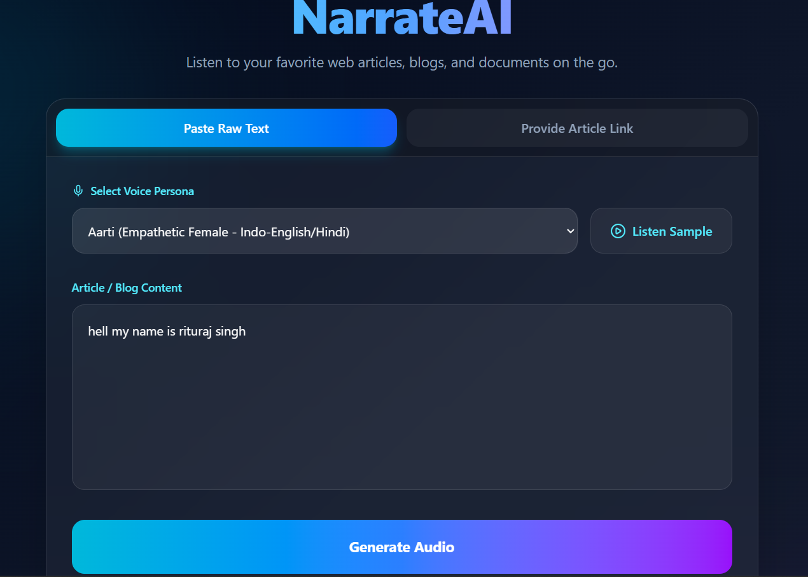
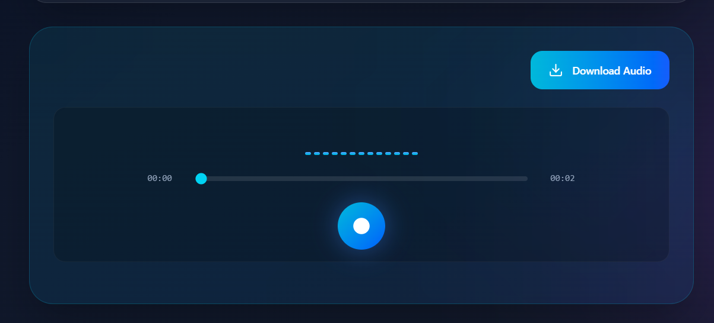

# 🎙️ NarrateAI — Enterprise AI-Powered Web Content Narration Platform

[](https://opensource.org/licenses/MIT)
[](https://react.dev/)
[](https://nodejs.org/)
[](https://azure.microsoft.com/en-us/products/cognitive-services/speech-to-text/)

NarrateAI is a production-ready, full-stack web application that dynamically transforms raw, unstructured text and live web article URLs into high-fidelity, context-aware audio narration. By combining optimized DOM parsing scrapers with cutting-edge Azure AI Speech Synthesis engines, the platform replicates human-like prosody, dynamic breathing patterns, and localized accent inflections.

---

## 📸 User Interface Preview

### Main Content Generation Dashboard


### Glassmorphic Interactive Audio Player Console


---

## ✨ System Features

- **Automated Document Extraction & Sanitization**: Seamlessly switches between parsing raw user text or crawling active web article URLs. When a URL is provided, an asynchronous backend scraping routine fetches the target HTML DOM, passing it through an implementation of Mozilla's Readability algorithm to isolate primary text nodes while stripping page noise (ads, tracking scripts, navigation elements, paywalls, cookies).
- **Dynamic Local Audio Sample Previews**: Features an independent preview loop endpoint allowing users to preview selected premium voice actor personas on-demand. This caches introductory audio clips locally to minimize Azure character credit usage.
- **Elite Neural HD Voice Catalog**: Built-in native support for Microsoft Azure's highest fidelity, context-aware voices—specifically optimized for conversational Indian English (`en-IN-AartiNeural`, `en-IN-ArjunNeural`) and expressive American English HD engines.
- **State-Locked Glassmorphic Control Deck**: Custom-engineered React media player utilizing native HTML5 audio event listeners (`onTimeUpdate`, `onLoadedMetadata`) to calculate true duration metrics, execute microsecond-precise timeline scrubbing, and drive a Framer-Motion animation loop that locks visualizer waveforms when playback is paused.
- **Direct Offline Storage Compilation**: Automatically bundles synthesized voice outputs into standard `.mp3` binaries, exposing a single-click download pipeline that saves files using automated UNIX timestamp naming conventions (`NarrateAI-17158...mp3`).

---

## 🏗️ Architectural Topology & System Flow

```text
       ┌────────────────────────────────────────────────────────┐
       │               Frontend: React.js SPA                   │
       └───────────────────────────┬────────────────────────────┘
                                   │
                                   ▼ HTTP POST (JSON Payload)
       ┌────────────────────────────────────────────────────────┐
       │             Backend: Express.js API Server             │
       └───────┬────────────────────────────────────────┬───────┘
               │                                        │
               ▼ (On URL Input)                         ▼ (Payload Dispatch)
┌──────────────────────────────┐        ┌──────────────────────────────┐
│    Web Scraping Pipeline     │        │     Azure AI Speech SDK      │
│  (JSDOM + Readability Core)  │        │   (Subscription Auth Handshake)│
└──────────────┬───────────────┘        └──────────────┬───────────────┘
               │                                        │
               ▼ (Sanitized Content)                    ▼ (Neural Processing)
┌──────────────────────────────┐        ┌──────────────────────────────┐
│  Noise Filtered Text Array   ├───────►│ Cloud Voice Synthesis Engine │
│  (Strips Ads, Nav, Cookies)   │        │ (prosody, breathing, accents)│
└──────────────────────────────┘        └──────────────┬───────────────┘
                                                       │
                                                       ▼ Binary Chunk Stream
                                        ┌──────────────────────────────┐
                                        │  Local Cache (public/ dir)   │
                                        │  (Stream Node Layer: 24kHz)  │
                                        └──────────────┬───────────────┘
                                                       │
                                                       ▼ Streamable Asset URL
                                        ┌──────────────────────────────┐
                                        │   React Audio Console UI     │
                                        └──────────────────────────────┘

```

### Deep-Dive Processing Workflows:

1. **The Ingestion Pipeline**: When a web link arrives at `/api/generate-audio`, the Express app utilizes a robust `fetch` handshake spoofing a modern browser agent string to prevent security blocking. `JSDOM` reconstitutes the markup object, allowing `@mozilla/readability` to isolate structural landmarks (like `<article>`, `<h1>`, and consecutive `<p>` tags) while discarding `<nav>`, `<iframe讲解>`, and sidebar elements.
2. **Synthesis & Range-Request Handling Middleware**: Cleaned strings are truncated at a 4,000-character threshold to maintain efficient payload sizes. The text is processed using Azure's `Audio24Khz48KBitRateMonoMp3` stream configuration. To prevent browsers from throwing `Range Not Satisfiable` network errors when scrubbing timelines, a dedicated Express route interceptor cleans byte-range request structures (`bytes=0-`) dynamically.

---

## 🛠️ Technical Stack

### Frontend Core

* **Framework Core**: React.js (Scaffolded with Vite for Hot Module Replacement and production roll-up trees)
* **Styling Architecture**: Tailwind CSS (Leveraging custom utilities for translucent backdrop blur styling)
* **Animation Layer**: Framer Motion (Managing keyframe physics arrays for the visualizer equalizers)
* **Design Assets**: Lucide React Icons

### Backend Core

* **Runtime Layer**: Node.js (Long Term Support Release)
* **Server Framework**: Express.js
* **Cloud Cognitive Gateway**: Microsoft Azure Cognitive Services Speech SDK (`microsoft-cognitiveservices-speech-sdk`)
* **Document Model Extractor**: JSDOM & `@mozilla/readability`
* **Security Middleware**: CORS (Cross-Origin Resource Sharing)

---

## 📁 Project Directory Mapping

```text
NarrateAI/
├── frontend/
│   ├── src/
│   │   ├── App.jsx             # Core React view, audio controller mechanics, UI state engine
│   │   ├── main.jsx            # React root application bootstrap
│   │   └── index.css           # Global styles and Tailwind injection directives
│   ├── public/                 # Static frontend structural configuration assets
│   ├── package.json            # Node package configurations for frontend dependencies
│   └── vite.config.js          # Vite build compilation layer settings
│
├── backend/
│   ├── public/                 # Local media cache folder (Auto-generated at runtime)
│   │   ├── preview-*.mp3       # Saved sample actor audio intro files
│   │   └── speech-*.mp3        # Generated long-form article narrations
│   ├── server.js               # Express API gateway, scraper pipelines, Azure integrations
│   ├── .env                    # Local environment variables and infrastructure secrets
│   └── package.json            # Server package configurations and SDK references
│
└── README.md                   # System documentation artifact

```

---

## 🛠️ Local Environment Installation & Deployment

### Prerequisites

* [Node.js (v18.0.0 or higher)](https://nodejs.org/)
* Stable npm environment package manager
* Active Microsoft Azure Subscription with a Cognitive Speech Service instance provisioned (Free F0 Tier supported).

### 1. Repository Instantiation

Clone the project repository workspace folder straight onto your local target device directory path:

```bash
git clone [https://github.com/YOUR_USERNAME/NarrateAI.git](https://github.com/YOUR_USERNAME/NarrateAI.git)
cd NarrateAI

```

### 2. Configure Backend Credentials

Navigate into your server-side backend working directory and construct a new private environment configuration file:

```bash
cd backend
touch .env

```

Open `backend/.env` in your preferred text or code editor and map out your unique Azure resource instance parameters:

```env
PORT=5000
AZURE_SPEECH_KEY=your_unique_azure_speech_service_secret_key
AZURE_SPEECH_REGION=westus2

```

*Note: Ensure your `AZURE_SPEECH_REGION` is specified as a standard, purely lowercase string mapping token without extra spaces or symbols (e.g., `eastus`, `centralindia`, `westus2`).*

### 3. Dependency Initialization

Install all required system node dependencies across both detached application structures:

**Initialize Server Backend Packets:**

```bash
cd backend
npm install

```

**Initialize Client Frontend Packets:**

```bash
cd ../frontend
npm install

```

---

## 🚀 Launching the Application

To evaluate NarrateAI on your local workstation, initialize both decoupled software engines across two separate system terminal shell instances:

### Terminal Window 1: Boot the Express API Service Layer

```bash
cd backend
node server.js

```

*Expected Terminal Validation Logs:*

```text
Backend API actively running on http://localhost:5000
DEBUG CHECK - Key Loaded: YES
DEBUG CHECK - Region Loaded: westus2

```

*(The backend logic automatically checks if a local `public/` folder exists on your storage drive when starting up, creating it automatically if missing to avoid runtime storage failures).*

### Terminal Window 2: Spin Up the Hot Reloading React Interface

```bash
cd frontend
npm run dev

```

Open your web browser and load the specified development port address, typically pointing directly to: **`http://localhost:5173`**

---

## 🎧 Deep Dive: The Neural Voice System

Traditional legacy Text-to-Speech engines use rigid concatenation methods that result in robotic, synthetic cadences. NarrateAI addresses this issue by integrating Azure's advanced **Neural High-Definition (HD) Speech Framework**.

These neural voice avatars run on deep learning models that evaluate punctuation, syntax transitions, and overall sentence context simultaneously. This enables the platform to deliver:

* **Dynamic Breathing & Pauses**: Automatically inserts realistic inhales, exhales, and contextual pauses before commas or paragraph boundaries.
* **Advanced Prosody Manipulation**: Naturally emphasizes descriptive modifiers and intelligently lowers pitch registers toward the end of declarative statements.
* **Multi-Lingual Synthesis**: Seamlessly blends phonetic transitions when switching between English phrases and native Hindi terms within the same text block, offering natural voice continuity.

---

## 🔒 Project Hygiene & Key Protection

To safeguard production resource budgets and protect your software accounts from credential leakage, this repository maintains strict version control exclusions via an optimized **`.gitignore`** profile mapping matrix.

The setup explicitly prevents tracking the following local structures:

```gitignore
# Prevent pushing bloated local package dependency trees
node_modules/
frontend/node_modules/
backend/node_modules/

# Block cloud billing keys and credential variable files from public exposure
.env
.env.local

# Keep heavy local audio storage assets cached locally 
backend/public/speech-*.mp3
backend/public/preview-*.mp3

```

This safeguards your environment properties while ensuring that high-volume binary multimedia output folders never clog up your Git branch history tracking loops.

---

## 🌟 Strategic Future Improvements

* **Cloud Native Scalability**: Transition local storage caching structures over to centralized **Azure Blob Storage containers** backed by ephemeral expiry lifecycles.
* **Enterprise Access Management**: Integrate secure token systems via OAuth2 providers alongside **JWT (JSON Web Tokens)** session controls.
* **SSML Compilation Framework**: Introduce advanced custom Speech Synthesis Markup Language (SSML) optimization panels, allowing creators to granularly configure emotion ranges, whispering metrics, and specific accent behaviors.
* **Parallel Podcast Assembly**: Enable automated combining of multi-article textual data sets into cohesive, single-track audio podcast feed directories.

---

## 🤝 Contributing Guidelines

Contributions make the open-source community an amazing place to learn, inspire, and create. Any contributions you make are greatly appreciated.

1. Fork the Project Workspace
2. Create your Feature Branch (`git checkout -b feature/AmazingFeature`)
3. Commit your Changes (`git commit -m 'Add some AmazingFeature'`)
4. Push to the Branch (`git push origin feature/AmazingFeature`)
5. Open a formal Pull Request for code review

---

## 📜 License Documentation

Distributed under the open-source **MIT License**. See the `LICENSE` file template for more details.

---

## 🚀 Pushing Updates to Your Live GitHub Remote Repository

Once you have reviewed and saved your codebase adjustments, execute these terminal commands to stage your README alterations, bundle them safely, and upload the code to your GitHub platform profile:

```bash
git add README.md
git commit -m "Docs: Update README with comprehensive professional full-stack layout and badges"
git push origin main

```

```
***

This markdown is tailored for a professional portfolio. It clearly highlights your engineering choices (such as handling byte-range requests for scrubbing stability and implementing clean DOM-scraping algorithms) while cleanly breaking down deployment commands.

```
